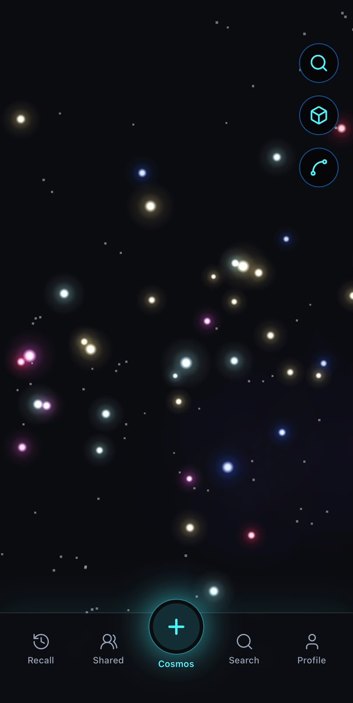
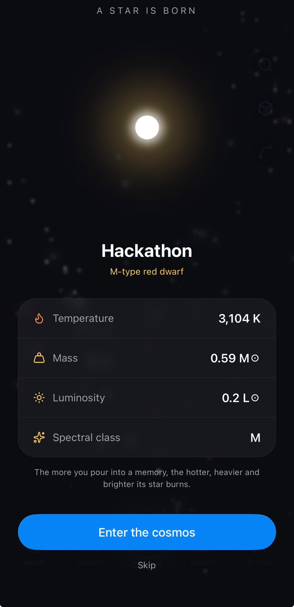
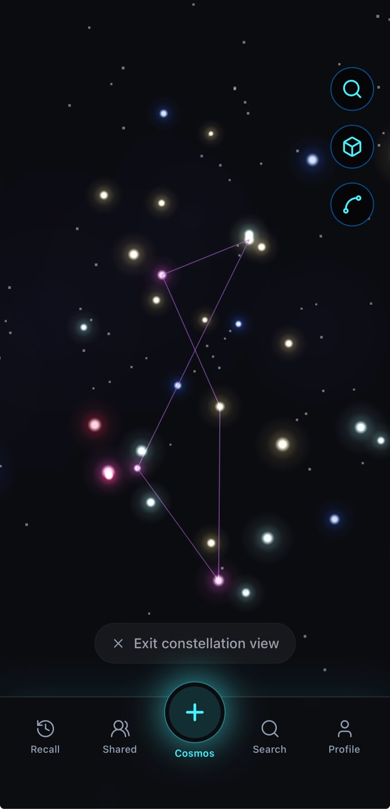
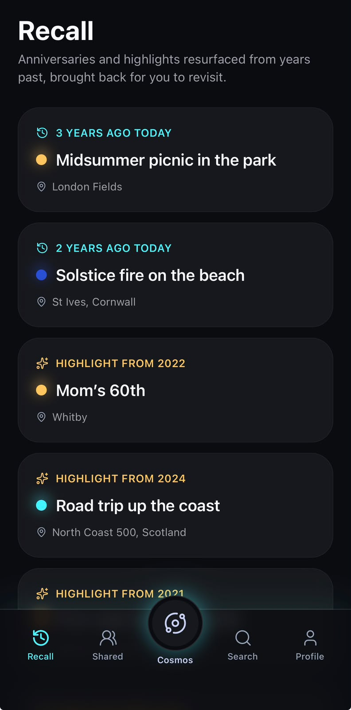

# Memoria

> Your memories, kept luminous among the stars.

**Memoria** is a multi-media journaling app that turns the moments of your life into a living cosmos. Every memory becomes a twinkling star, drifting in a rendered 3D void. Write the story, attach photos and voice notes, tag the people who were there — and watch it ignite into the sky. Over the years your memories cluster into constellations, and your personal universe slowly fills with light.

---

## ✦ Try it in 60 seconds (for judges)

**On your phone, install Expo Go first:** [iOS](https://apps.apple.com/app/expo-go/id982107779) | [Android](https://play.google.com/store/apps/details?id=host.exp.exponent)

Then:

1. **On your laptop**, open the live preview:
   **https://app.bilt.me/project/156683ab-3e17-439f-8ed0-8c9382b5d29a/preview**
2. A **QR code** is shown on that page.
3. **Scan it with Expo Go** (Android: tap "Scan QR code" in the app · iPhone: point the Camera app at it and tap the banner).
4. Memoria opens on your phone — no install, no terminal, no setup.

> Prefer to skip your phone? The same preview page lets you run the app right in your browser.

**Then load the full demo instantly:** open the **Profile** tab and **long-press the footer line** ("Your memories are kept luminous among the stars."). This loads a populated profile — Alex Rivera, 38 memories across several years and 8 constellations — so the cosmos is full to explore.

> No API keys or backend required to run and explore the app. Location search and any AI extras are optional and degrade gracefully when their keys aren't set.

---

## ✦ The idea

Most journals are lists. Memoria is a _sky_.

- A short note becomes a small, faint star. A long, photo-rich, voice-laden memory ignites into a bright giant. The weight of what you lived is reflected in how brightly it burns.
- Pan, pinch and orbit through your own universe. Tap any star to relive the moment.
- Group related memories into **constellations** — a trip, a friendship, a chapter of your life — and watch the lines draw between them.
- Share a sky. Create a **shared cosmos** with family or friends so memories you all hold can live in one place.

## ✦ Core features

- **Stars from memories** — title, story, date, location, up to 3 photos and 4 voice notes, plus people tagging. Star size and brightness are derived from the richness of the memory.
- **A real 3D cosmos** — a WebGL/native scene (react-three-fiber + three) with orbit-drag, pinch-zoom, gentle twinkle, drifting dust, a faint Milky Way haze, and ambient shooting stars. Toggle between an immersive **3D** view and a flat **2D** map.
- **Star ignition** — saving a memory plays a protostar → contraction → ignition flash → true-color sequence while its "stellar stats" (temperature, mass, spectral class, luminosity) count up.
- **Constellations** — forge groups manually by tapping stars in order, or accept suggested groupings (shared place, shared people, same month). Lines fade in on focus and replay a glowing draw animation when viewed.
- **Recall** — an "on this day" surface that weaves together anniversaries and random highlights from across your years.
- **Shared cosmos** — collaborative full-screen spaces you create and invite people into; memories saved there live in that shared sky.
- **Search & focus** — find a memory by title, location, people or group, then dive: the camera performs a cinematic deep-zoom onto the star and opens it in a floating detail panel.
- **Profile & storage** — an editable identity (name, bio, avatar photo or color), a friends list, and a luminous storage meter with a freemium capacity tier.

## ✦ Design

- **Dark-only, glassmorphic UI** built on HeroUI Native + Uniwind.
- **"Midnight Aurora" palette** — a Deep Cosmos `#0B0C10` void, Stellar Cyan accent, Electric Rose, Warm Amber and Deep Violet emotion colors.
- **Typography** — Orbitron for the wordmark, Space Grotesk for display, Inter for UI, and Lora for the memory story body.
- A first-run coachmark and a post-first-star tab walkthrough gently teach the cosmos.

## ✦ Tech

This project is built with:

- React Native + Expo (Expo Router for navigation)
- TypeScript
- react-three-fiber + three + expo-gl (the 3D cosmos), with react-native-skia for ignition/preview effects
- Zustand + AsyncStorage (local-first state, mock accounts)
- HeroUI Native + Uniwind (design system & theming)
- Google Places (location search), expo-image-picker, expo-audio

All generated and orchestrated by Bilt from natural-language instructions.

---

## ✦ Showcase

<table>
  <tr>
    <td align="center" width="25%">
       
      <b>The cosmos</b> — every memory a twinkling star
    </td>
    <td align="center" width="25%">
       
      <b>Star ignition</b> — a new memory is born
    </td>
    <td align="center" width="25%">
       
      <b>Constellations</b> — lines drawn between moments
    </td>
    <td align="center" width="25%">
       
      <b>Recall</b> — anniversaries &amp; highlights resurfaced
    </td>
  </tr>
</table>

> Captured from the built-in demo profile (long-press the Profile footer to load it), so the sky looks full.

---

**Memoria — built with [Bilt](https://bilt.me).** ✦

